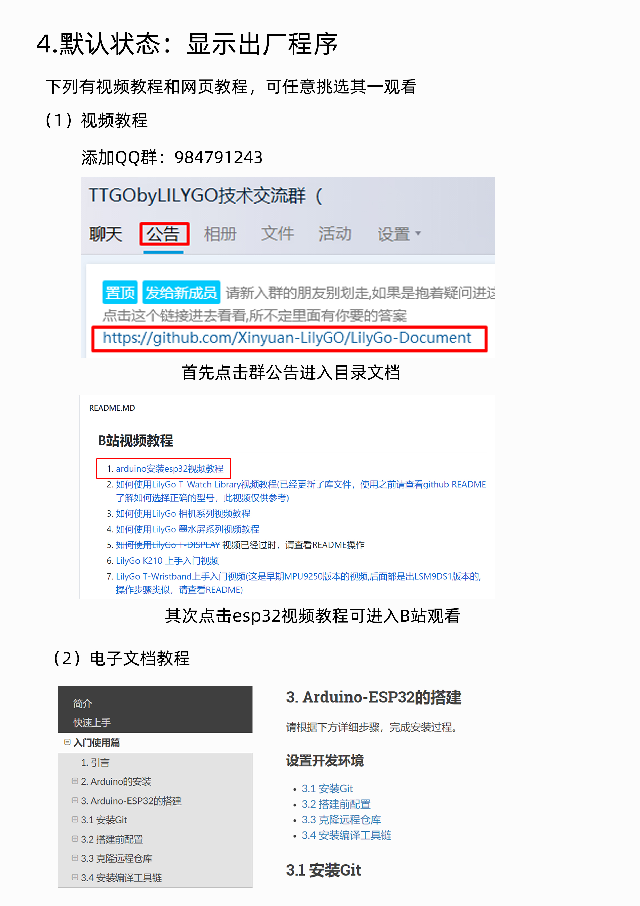

=============
快速上手
=============

程序选择
==============

* :ref:`get-stared-build`
* :ref:`get-stared-config`
* :ref:`get-stared-download`
* :ref:`get-stared-use`

.. _get-stared-build:

1. 搭建气象程序
===============

.. image:: ../_static/page1.jpg

https://t-watch.readthedocs.io/zh_CN/latest/basics/index.html

.. _get-stared-config:

2. 恢复出厂固件
==================

安装Flash Download Tools 
+++++++++++++++++++++++++

乐鑫烧录下载工具ESP Flash Download Tool: :download:`Download <https://www.espressif.com/zh-hans/support/download/other-tools>`
  

选择下载，浏览器开始自动下载烧录工具

.. note::
    需要选择ESP32，选择其他型号，固件将会无法烧录

安装CH9102驱动
++++++++++++++++

安装驱动可到 :ref:`资源下载/驱动<drive_download>` 中获取。

下载固件
++++++++++++++++

安装固件可到 :ref:`资源下载/固件<firmware_download>` 中获取。

``ESP Flash Tool`` 设置操作见下：

* ``COM``：烧录设备端口选择，如只有一个设备，可直接选择。
* ``BAUD``：下载波特率，建议921600
* ``SPI SPEED``：40MHz
* ``SPI MODE``：DIO

.. important::
    点击Start后,请等待100%,界面左下角显示Finish（完成）时，再关闭软件。

.. _get-stared-download:

3. 墨水屏阅读器
==================
正在添加中...
++++++++++++++++

.. _get-stared-use:

4. 桌面屏幕摆件
================

正在添加中...
++++++++++++++++