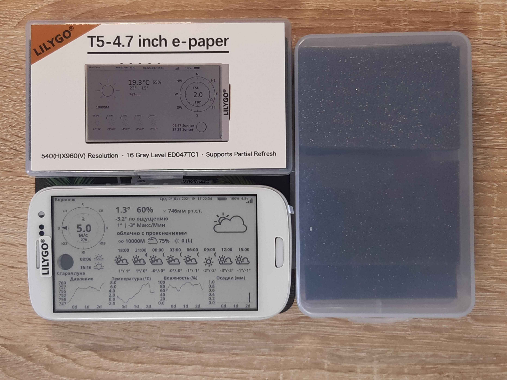
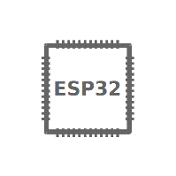

.. Arduino 编程指南 documentation master file, created by
   sphinx-quickstart on Fri Apr 19 14:10:11 2019.
   You can adapt this file completely to your liking, but it should at least
   contain the root `toctree` directive.

T5-EPD47 中文使用文档
=====================

LILYGO T5-EPD47 是深圳芯元电子推出的一款墨水屏可编程ESP32开发板

LILYGO T5-EPD47 是深圳芯元电子推出的一款墨水屏可编程ESP32开发板

==================  ==================  ==================
|简介|_              |快速上手|_         |环境搭建|_
------------------  ------------------  ------------------
`简介`_              `快速上手`_         `环境搭建`_
------------------  ------------------  ------------------
|相关链接|_           |下载资源|_         |常见问题与解答|_
------------------  ------------------  ------------------
`相关链接`_           `下载资源`_         `常见问题与解答`_
==================  ==================  ==================

.. |简介| image:: _static/get-started1.gif
.. _简介: introduction/index.html

.. |快速上手| image:: _static/api-reference.gif 
.. _快速上手: get-started/index.html

.. _环境搭建: basics/index.html

.. |常见问题与解答| image:: _static/api-guides.gif
.. _常见问题与解答: advanced/index.html

.. |下载资源| image:: _static/contribute.gif
.. _下载资源: download/index.html

.. |相关链接| image:: _static/resources.gif
.. _相关链接: related-links/index.html

.. toctree::
   :hidden:

   简介 <introduction/index> 
   快速上手 <get-started/index>
   环境搭建 <basics/index>
   相关链接 <related-links/index>
   下载资源 <download/index>
   常见问题与解答 <advanced/index> 

    