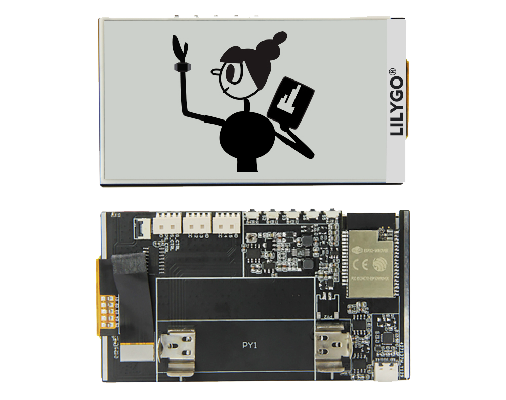
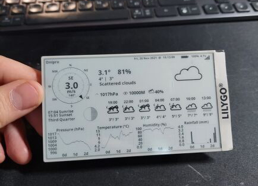
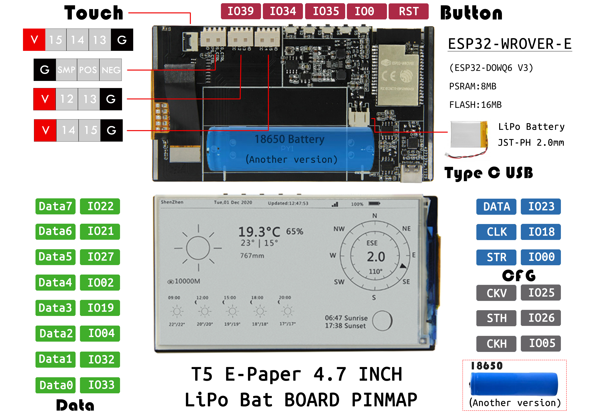
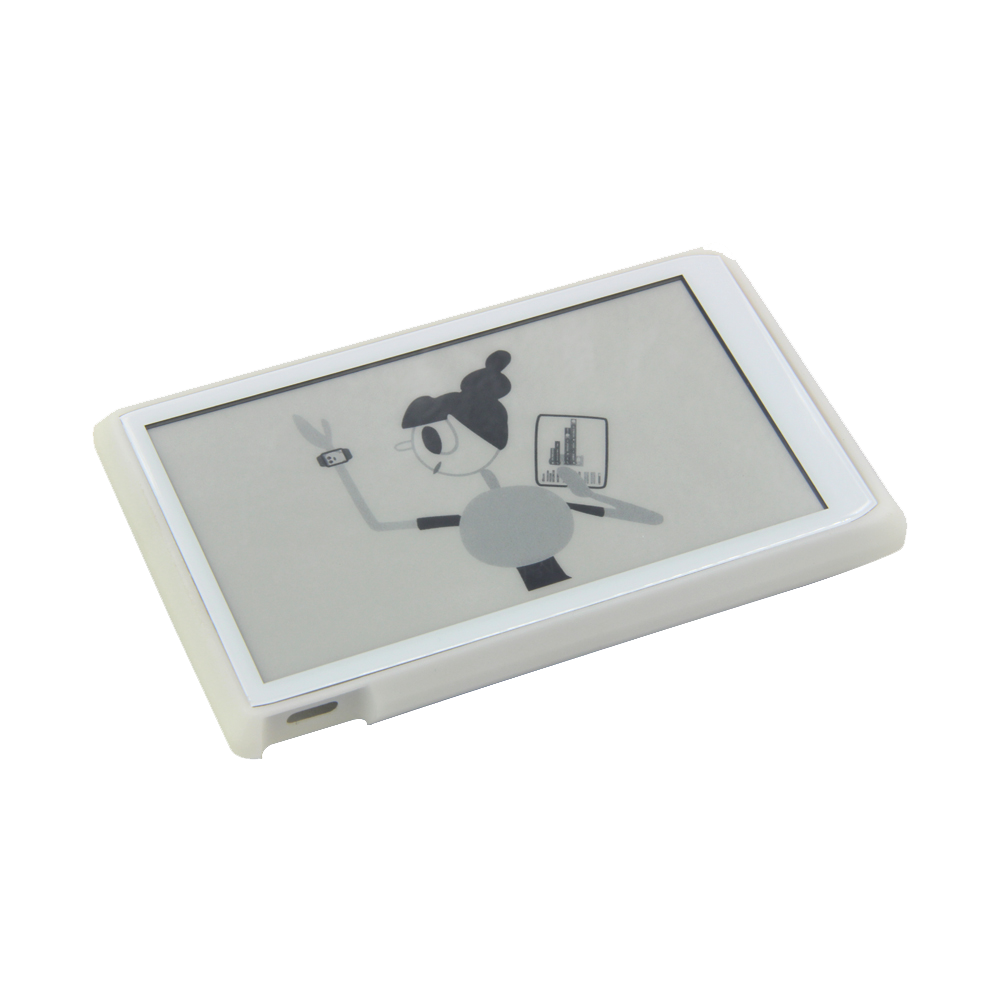
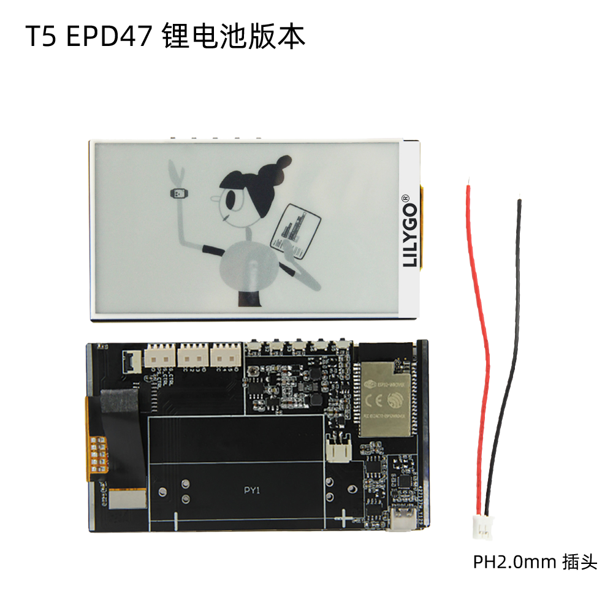
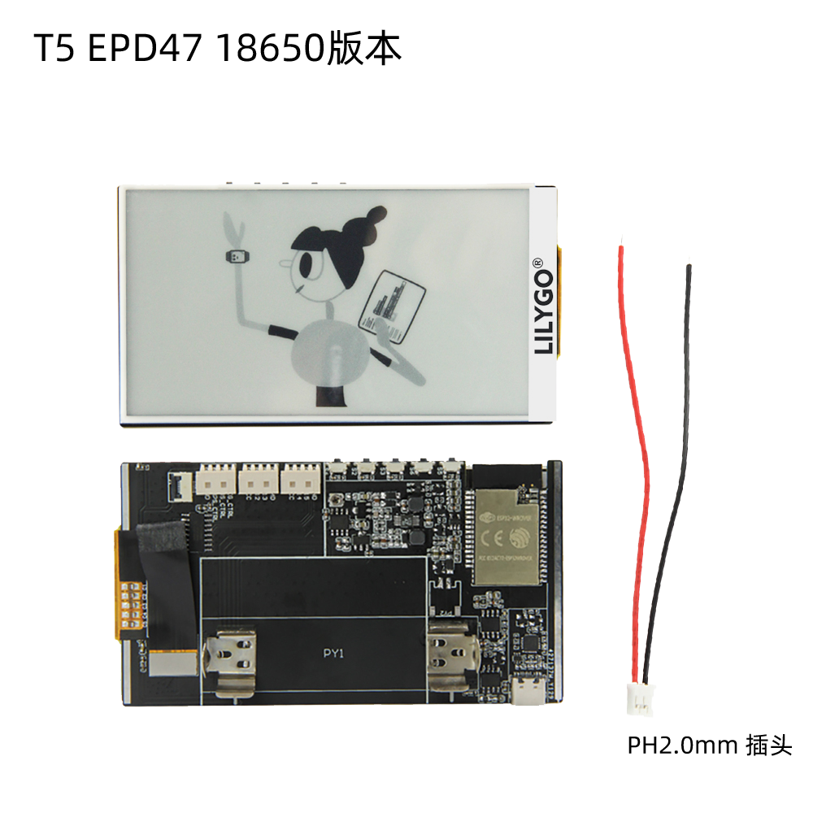

==============
T5-EPD47简介
==============

硬件概述
==============

* :ref:`technical-parameters`
* :ref:`appearance-specification`
* :ref:`component-layout`
* :ref:`pin-definition`

.. _technical-parameters:

1.技术参数
==============

LILYGO T5 EPD47开发板板载功能:

- 主芯片：**ESP32**
- **4.7英寸电子墨水屏**
- 支持触摸功能
- 可拓展传感器插槽
- 支持复位RESET按键 硬重启
- 18650电池/3.7V锂电池（**版本可选**）
- 可编程按键：IO39、IO34、IO35、IO0

.. note::
  
  墨水屏，又称电子纸，简称ePaper，是显示器技术。重点在于模仿以在纸上印刷、书写的视觉观感，而耗电量极小。不同于一般的(OLED)以发光达成显示功能，
  电子纸如同普通纸一样，依靠环境光照亮，所以理论上阅读起来较舒适，而且其显示的影像能在阳光直照下仍然清晰可见

- **ESP-32** 主控：

  - CPU：Xtensa双核32位LX6微处理器，工作频率为240 MHz，最高可达600 DMIPS
  - 超低功耗（ULP）协处理器
  - 内存：520 KiB SRAM
  - Wi-Fi：802.11 b / g / n
  - 蓝牙：v4.2 BR / EDR和BLE

.. figure:: ../_static/get_started2.jpg 
   :scale: 40
   :align: center

- 供电方式：Type-C USB/锂电池
- 工作电压：3.3V

.. note::
  
  ESP32 由总部位于上海的中国公司乐鑫信息科技创建和开发，由台积电采用40纳米技术制造。
  它是ESP8266微控制器的后继产品。

.. _appearance-specification:

2.引脚定义
==============

.. note::
  
  引脚图：可查看模块连接脚位，以及显示编程可使用的GPIO脚位

.. _component-layout:

3.外观规格
==============

.. note::
  
  3D可打印外壳，可在GitHub下载3D外壳文件

.. _pin-definition:

4.发货清单
==============

.. image:: ../_static/2.jpg

